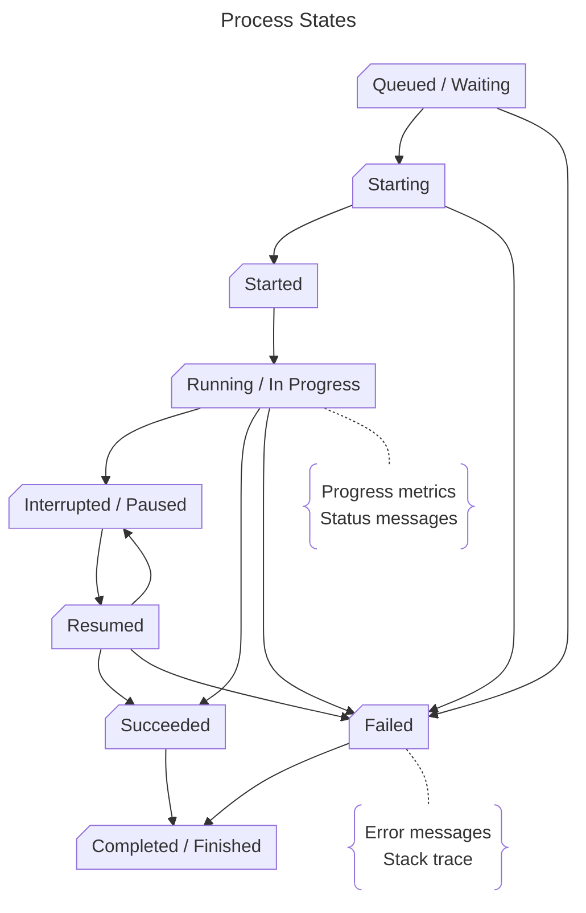
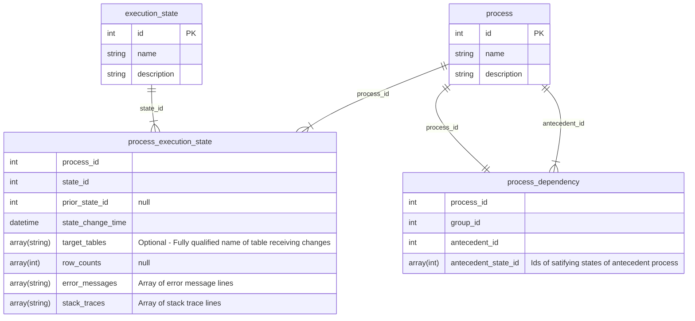

# Dependency Management
In Data Engineering, it is often a requirement that a process only run upon success, failure, or completion of one or more antecedents.

It is also desirable that these processes be as loosely coupled or independent as possible.

Below, I outline a design pattern that accomplishes these goals.

## Process Execution
A given process might be invoked manually, on a schedule, or through some other triggering action (receipt of an email, presence of a new file, etc.)

As a process executes, it will go through various states:

A given process might not emit each of these state changes, and the environment designer may not be concerned with handling every one of them.

## State Capture
A repository is needed to capture the intersection of process, state & time.  It should also provide optional capture of progress messages, errors, etc.

## Definitions & Examples
* __Simple:__ a completely self-contained operation; it cannot reasonably be broken down into smaller processes.
    * ADF Copy Activity
    * Single SQL DML statement (Insert, Update, Delete, Merge)

* __Complex:__ a tightly-coupled set of related operations; while it might be possible to separate them it's not beneficial at the time or in the forseeable future.
    * Get watermark; load data based on watermark; update control table with new watermark; store audit data.
    * Copy files from SFTP; decrypt files; parse file contents to parquet; move files on SFTP host to archive folder

* __Dependent:__ a process which requires one or more antecedent processes to reach a certain state prior to execution.
    * A reporting dataset cannot be calculated until each source dataset has been updated to a certain timeframe.
    * A background data archival cannot run on a given dataset if a load or transformation process is running against the dataset.

## Self-Reporting & Polling
* A simple process should persist its progression through various states.  
    Time | Process | State
    --- | --- | ---
    12:00 | Load_SKU | Starting
    12:01 | Load_SKU | Running
    12:07 | Load_SKU | Succeeded

* A complex process should persist progression through various states for itself, and each of its sub-processes (or delegate persistence to them.)  
    Time | Process | State
    --- | --- | ---
    13:00 | Google_load | Started
    13:00 | Google_load | Running
    13:01 | -> Google_users_load | Started
    13:01 | -> Google_events_load | Started
    13:04 | -> Google_users_load | Succeeded
    13:09 | -> Google_users_load | Succeeded
    13:09 | -> Google_process | Started
    13:09 | -> Google_process | Running
    13:17 | -> Google_process | Succeeded
    13:18 | Google_load | Succeeded

* A dependent process should observe the persisted data and:
    * derive its runnable state from the data;
    * determine its retry / wait / abandon logic;
    * persist its attempts to run

    Time | Process | State
    --- | --- | --- |
    14:00 | Do_Stuff | Queued, awaiting X & Y
    14:05 | Do_Stuff | Queued, awaiting Y
    14:10 | Do_Stuff | Started

## The Dependency Model
Dependencies can be many-to-many relationships.  While direct invocation is acceptable (and simpler!) in some cases, this model gives fine-grained control (at the cost of some complexity.)

### Patterns
* Direct invocation is acceptable when:
    * When Process A is always the only thing Process B depends upon;
    * When Process A, and only A, should always spawn B, C, D & E, direct invocation is acceptable but should be carefully considered.

* This Dependency Model should be used when:
    * When Process A depends on completion of multiple Processes
    * When Process A has complex dependencies 
        * ex. (Process B succeeded in last 12 hours OR was cancelled in last 24 hours) AND Process C failed...

### Anti-patterns
* Processes A & B pass messages to coordinate invocation of Process C.
* A Process only reports its status after combining its status with that of another process.
* Human intvervention

### How It Works
1. A process is _registered_, meaning it is defined in the `process` table and 

This necessitates that the process determine its own viability based on observing its antecedents.  (The antecedents neither invoke the process, nor need even have knowledge of them.)

The process dependencies can change over time, so directly invoking one process from another should only be done when a high degree of confidence exists that it will be stable over long periods of time.

## Future Capabilities
Provide an overwatch / bot mechanism to examine process state progress and trigger processes when aggregate conditions are satisfied.
